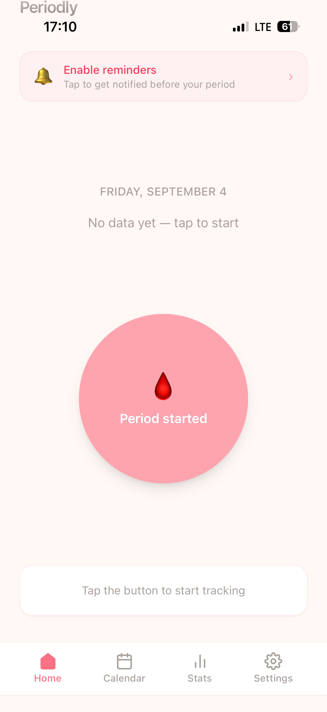

# Periodly

A minimalist period tracking PWA — one tap, fully private, no account required.

**[→ Try it live](https://periodlytracking.netlify.app)**



---

## Why Periodly?

Most period tracking apps require an account, upload your health data to the cloud, and are bloated with features. Periodly does one thing well: it reminds you before your period arrives — and it learns your cycle automatically.

- **One tap** to log your period start — that's it
- **Learns your cycle** — adapts notification timing automatically based on your history
- **Real push notifications** — reminds you even when the app is closed, no need to open it first
- **No account** — nothing to sign up for, ever
- **No cloud** — all period data stays on your device (IndexedDB)
- **Free** — no subscription, no ads, no tracking

---

## Features

- 🩸 One-tap period logging with smart confirmation
- 📅 Calendar view with period history
- 📊 Statistics — average cycle length, period duration, next expected date
- 🔔 Web Push notifications (works on iOS 16.4+ and Android)
- 💾 Export data as JSON backup
- ⚙️ Configurable settings (cycle length, notification timing, confirmation window)

---

## Install on iPhone

1. Open Safari and go to your deployed URL
2. Tap the Share button (square with arrow)
3. Tap **"Add to Home Screen"**
4. Open the app from your home screen
5. Tap **"Enable reminders"** and allow notifications

---

## Run locally (for developers)

**Requirements:** Node.js 18+

```bash
git clone https://github.com/periodly-app/periodly.git
cd periodly
npm install
npm run dev
```

Open `http://localhost:5173` in your browser.

---

## Deploy your own instance

### 1. Generate VAPID keys

```bash
npx web-push generate-vapid-keys
```

### 2. Deploy to Netlify

- Push this repo to GitHub
- Connect it to Netlify (or use Netlify Drop)
- Set the following environment variables in Netlify:

| Variable | Value |
|----------|-------|
| `VAPID_PUBLIC_KEY` | Your generated public key |
| `VAPID_PRIVATE_KEY` | Your generated private key |
| `CONTACT_EMAIL` | Your email address (required by Web Push spec) |

### 3. Update the public key in the client

In `src/lib/push.js`, replace `VAPID_PUBLIC_KEY` with your own public key.

### 4. Build and deploy

```bash
npm run build
```

Drag the `dist` folder to Netlify Drop, or use Netlify's continuous deployment.

---

## Tech Stack

| Layer | Technology |
|-------|-----------|
| Framework | React 18 |
| Styling | Tailwind CSS |
| Storage | IndexedDB (via idb) |
| Push Notifications | Web Push API + Netlify Functions |
| Server storage | Netlify Blobs |
| Hosting | Netlify (free tier) |
| Build tool | Vite |

---

## Privacy

All period data is stored **locally on your device** using IndexedDB. Nothing is ever sent to a server.

The only data stored server-side is your push notification token and the date of your next expected notification — no health data, no personal information.

---

## Support

Periodly is free and will stay free. If you find it useful, a coffee helps keep the server running!

[](https://buymeacoffee.com/maxelfy)

---

## License

MIT — free to use, modify, and distribute.
